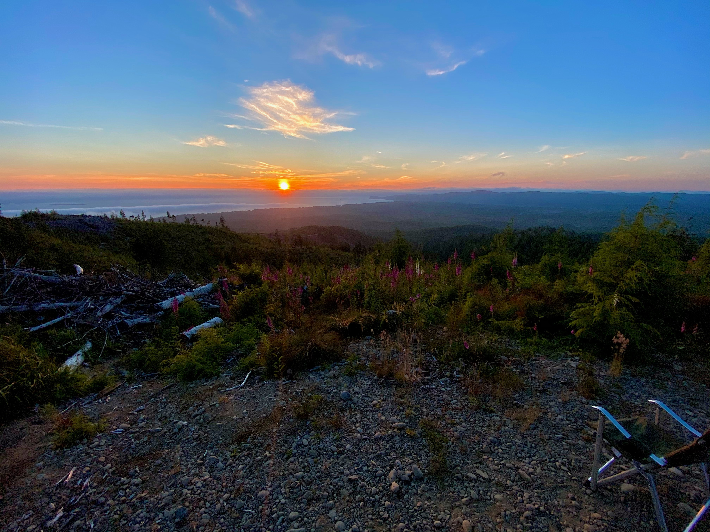

## Module 1 - Cool Stuff on Markdown and Gowth Mindsets
[Main Page](./README.md)

- Learn about a [Growth Mindset here!](https://vbchomp.github.io/reading-notes/Growth.md)

- Learning how to link images (next comes learning how to size them properly! :)

  - Camping on the coast
  
  
  - Neowise Comet

- :clap:  for learning how to use emogis!

- [Markdown](https://vbchomp.github.io/reading-notes/Markdown.md)
